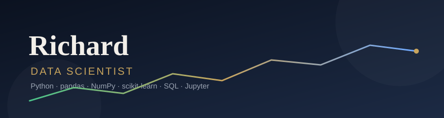

### Hi there, I'm Richard 👋

Data scientist. I work with data end to end — cleaning it, exploring it, modeling it, and turning it into decisions people can actually use.

- 💬 Ask me about: Python, data analysis, machine learning, data visualization
- 📫 Reach me: [LinkedIn](https://www.linkedin.com/in/richard-irawan-a395b2299/)

## 🛠️ Skills

## 📊 What I do

| Area | Tools |
|---|---|
| Data analysis & cleaning | pandas · NumPy · SQL |
| Machine learning | scikit-learn |
| Data visualization | matplotlib · Seaborn · Jupyter |
| Workflow | Git · GitHub · VS Code |

## 🤝 Connect

